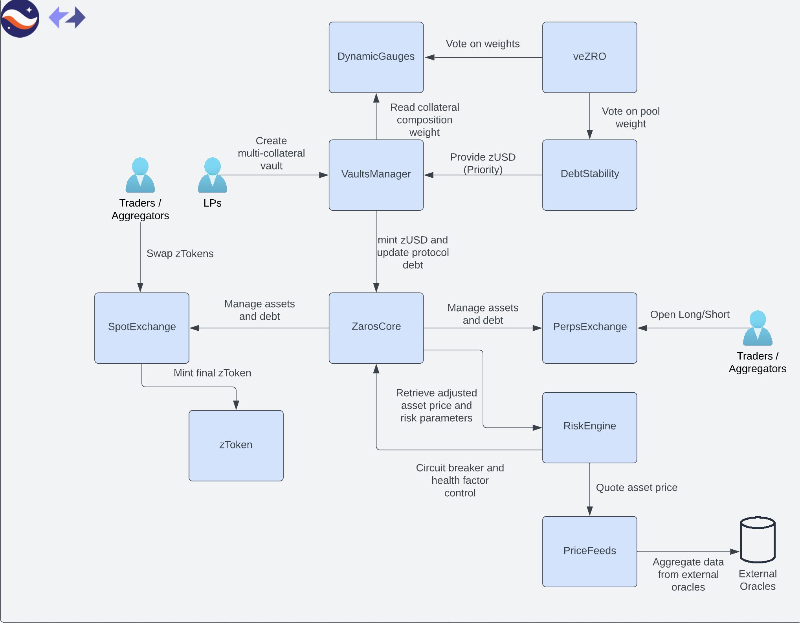

Zaros Core

# Abstract

Zaros is a multi-chain, multi-collateral, decentralized synthetic liquidity protocol. It's built on top of Ethereum's popular L2s StarkNet and zkSync, which provide the required security, scalability and high computational throughput to power the protocol features. In spite of the core liquidity protocol being deployed initially on both StarkNet and zkSync, protocol liquidity may be bridged across environments through the atomic bridge module. By having this separation of concerns, Zaros and its community are able to develop multiple DeFi products on top of the protocol modules and mitigate the liquidity fragmentation problem.

The 3 core values of Zaros Protocol are:

- Decentralization
- Scalability
- Capital Efficiency

So system modules and products built on top of the protocol aim to deliver to users all around the globe access to censorship resistant DeFi liquidity with low costs while preserving capital efficiency, unlocking high liquidity and delivering a personalized experience for each user's profile.

# Overview

The protocol is composed by a set of smart contracts divided into different system modules:

# 

# Addresses

- Zaros: https://goerli-2.voyager.online/contract/0x0265e292c3209cf0bd7b65c063f02ed67f1bac43a6771aa76016f44a26b1ecad
- zUSD: https://goerli-2.voyager.online/contract/0x01838939e7b6c98b46a0a1ad0fcbeabad7fc28364b1f5a7ab6eedc48f6824326
- VaultsManager: https://goerli-2.voyager.online/contract0x0208722b1af4c9d0d9d51ce85864d2976b1ec322fb10d056f1c2b539cc109448
